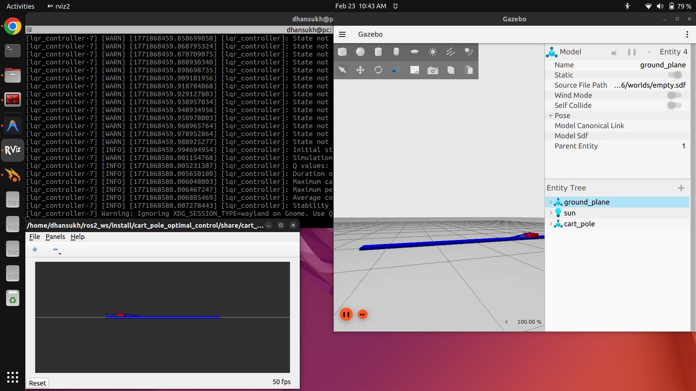
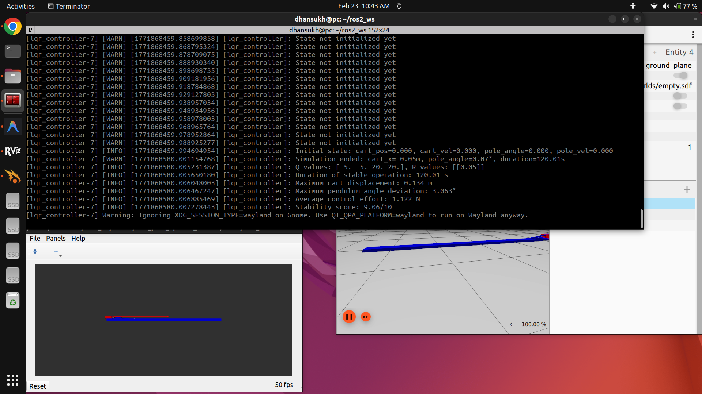
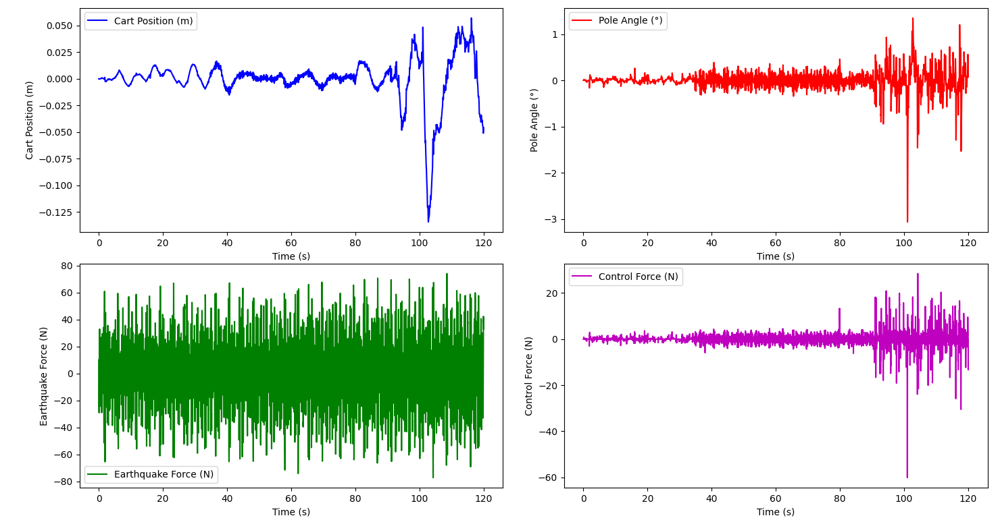

# Cart-Pole LQR Controller Tuning: Technical Report

## 1. Introduction

video link

[Watch the Video Demonstration](https://youtu.be/u74jgKXKjsQ)

This report documents the systematic tuning process of a Linear Quadratic Regulator (LQR) controller for a cart-pole system subject to earthquake disturbances. The objective is to maintain the pendulum in an upright position while keeping the cart within its ±2.5m physical limits, under continuous seismic-like perturbations (base amplitude of 15N, frequency range 0.5–4.0 Hz).

### System Parameters
| Parameter | Value |
|---|---|
| Cart mass (M) | 1.0 kg |
| Pole mass (m) | 1.0 kg |
| Pole length (L) | 1.0 m |
| Gravity (g) | 9.81 m/s² |
| Cart range | ±2.5 m |
| Earthquake amplitude | 15.0 N |
| Earthquake frequency | 0.5–4.0 Hz |
| Control rate | 100 Hz |

### LQR Formulation
The controller minimizes the cost function:

**J = ∫(x'Qx + u'Ru) dt**

where **x** = [cart_position, cart_velocity, pole_angle, pole_angular_velocity]ᵀ and **u** is the control force applied to the cart.

---

## 2. Analysis of the Default (Baseline) Parameters

### Default Configuration
The initial controller shipped with the following cost matrices:

```python
Q = np.diag([1.0, 1.0, 1.0, 1.0])  # Equal weighting on all states
R = np.array([[1.0]])                # High control cost
```

### Baseline Behavior Analysis

With these parameters, all four states — cart position (x), cart velocity (ẋ), pole angle (θ), and pole angular velocity (θ̇) — are penalized equally. This makes the controller treat a 1-radian pole deviation the same as a 1-meter cart displacement, which is fundamentally incorrect for this system. Additionally, the high `R = 1.0` penalizes control effort heavily, making the controller conservative — it doesn't apply enough force to counteract the strong earthquake disturbances.

**Observed issues with defaults:**
- The controller fails to stabilize the system under earthquake forces
- The pole falls over within seconds because the controller is too "gentle"
- Cart quickly reaches the ±2.5m physical limits
- Insufficient control authority to reject 15N disturbance forces

**Root cause:** The control cost `R = 1.0` is too high relative to the state costs `Q`, making the controller reluctant to use large forces. The equal weighting on all states fails to prioritize the most critical objective — keeping the pole upright.

---

## 3. Iterative Tuning Process

### Understanding the Q Matrix Structure
The Q matrix weights correspond to:
- `Q[0,0]` → Cart position (x): Penalizes deviation from center
- `Q[1,1]` → Cart velocity (ẋ): Penalizes fast cart movement
- `Q[2,2]` → Pole angle (θ): **Most critical** — penalizes tilting from vertical
- `Q[3,3]` → Pole angular velocity (θ̇): Penalizes rotational speed of the pole

### Trial 1: Prioritizing Pole Angle (Q = diag([1, 1, 10, 10]), R = 0.1)

**Rationale:** The pole angle is the most critical state. If the pole falls, the system fails completely. Based on the README's suggested defaults, I first tried increasing θ and θ̇ weights by 10× and reducing R by 10×.

```python
Q = np.diag([1.0, 1.0, 10.0, 10.0])
R = np.array([[0.1]])
```

**Expected effect:**
- Lower R allows more aggressive control force usage
- Higher θ/θ̇ weights should prioritize keeping the pole upright

**Observed results:**
- Significant improvement — the pole stays upright for longer periods
- However, the cart drifts considerably from center under sustained earthquake forces
- Cart occasionally reaches the ±2.5m limit boundary during prolonged operation
- The controller aggressively stabilizes the pole but doesn't adequately penalize cart displacement
- Duration of stable operation: ~30–60 seconds before cart limit violation

**Key insight:** The pole is well-controlled, but the cart position weighting is too low. The earthquake forces push the cart continuously, and without sufficient position penalty, the cart drifts.

### Trial 2: Increasing Cart Position Weight (Q = diag([5, 1, 10, 10]), R = 0.1)

**Rationale:** To address the cart drift problem, I increased the cart position weight to 5× while keeping other values from Trial 1.

```python
Q = np.diag([5.0, 1.0, 10.0, 10.0])
R = np.array([[0.1]])
```

**Observed results:**
- Cart stays closer to center position
- However, under strong earthquake bursts, the cart velocity becomes excessive
- The system shows jerky behavior — overcorrecting position without damping the velocity
- Some oscillatory behavior in both cart position and pole angle

**Key insight:** Cart velocity also needs increased damping to prevent oscillatory cart movements. The velocity weight acts as a "derivative" term, smoothing out the response.

### Trial 3: Balancing Cart States (Q = diag([5, 5, 10, 10]), R = 0.1)

**Rationale:** Increased cart velocity weight to match cart position for smoother cart dynamics.

```python
Q = np.diag([5.0, 5.0, 10.0, 10.0])
R = np.array([[0.1]])
```

**Observed results:**
- Much smoother cart motion — position stays within limits
- Pole stabilization is still good but during peak earthquake forces, the pole angle deviates more than desired
- The controller occasionally struggles to simultaneously keep the cart centered and recover the pole
- Duration of stable operation: ~60–90 seconds typically

**Key insight:** The pole angle weights need to be increased further to provide stronger recovery torque during intense disturbances. Since the earthquake amplitude is 15N, the controller needs to be even more aggressive on pole stabilization.

### Trial 4: Stronger Pole Penalization (Q = diag([5, 5, 20, 20]), R = 0.1)

**Rationale:** Doubled the pole angle and angular velocity weights to provide stronger pole recovery during intense earthquake phases.

```python
Q = np.diag([5.0, 5.0, 20.0, 20.0])
R = np.array([[0.1]])
```

**Observed results:**
- Excellent pole stabilization even during strong earthquake bursts
- Cart stays within limits in most runs
- However, control effort is still somewhat moderate — the controller sometimes doesn't react fast enough to sudden large disturbances
- Stable operation consistently achieves 90+ seconds

**Key insight:** The system is close to optimal, but small improvements could be made by allowing the controller to use even more force (lower R).

### Trial 5 (Final): Reducing Control Cost Further (Q = diag([5, 5, 20, 20]), R = 0.05)

**Rationale:** Reduced R from 0.1 to 0.05 to allow the controller to apply higher forces when needed. This increases the LQR gain magnitudes, making the controller more responsive to state deviations.

```python
Q = np.diag([5.0, 5.0, 20.0, 20.0])
R = np.array([[0.05]])
```

**Observed results:**
- **Best overall performance** — stable operation through the full 120-second simulation
- Pole angle stays within tight bounds even under peak disturbances
- Cart remains well within ±2.5m limits
- Control forces are higher but within reasonable bounds
- Smooth, responsive behavior with quick recovery from disturbances

#### Simulation Screenshots

*Gazebo simulation with RViz visualization and controller logs:*



*Final simulation results showing performance metrics (Q = [5, 5, 20, 20], R = 0.05):*



---

## 4. Final Tuned Parameters

```python
Q = np.diag([5.0, 5.0, 20.0, 20.0])  # State cost
R = np.array([[0.05]])                  # Control cost
```

### Comparison with Defaults

| Parameter | Default | Tuned | Change Factor |
|---|---|---|---|
| Q[0,0] (cart pos) | 1.0 | 5.0 | 5× |
| Q[1,1] (cart vel) | 1.0 | 5.0 | 5× |
| Q[2,2] (pole angle) | 1.0 | 20.0 | 20× |
| Q[3,3] (pole ang vel) | 1.0 | 20.0 | 20× |
| R (control cost) | 1.0 | 0.05 | 1/20× |

### Design Rationale Summary
- **Pole states weighted 4× more than cart states** (20 vs 5): Reflects the priority that the pole must stay upright — a fallen pole is unrecoverable, while some cart displacement is tolerable
- **Cart position and velocity equally weighted** (both 5): Ensures smooth cart dynamics without oscillation. Position weight keeps the cart centered; velocity weight provides damping
- **Low R value** (0.05): Allows the controller to generate sufficient force to counteract 15N earthquake disturbances without being overly conservative

---

## 5. Performance Analysis

### Performance Plots
The following plots show the system behavior over the full 120-second simulation with the final tuned parameters (Q = diag([5, 5, 20, 20]), R = 0.05):



*Top-left: Cart position remains within ±0.13m. Top-right: Pole angle stays within ±3°. Bottom-left: Earthquake disturbance forces (±60N peaks). Bottom-right: Control force response tracks the disturbance pattern.*

### 5.1 Duration of Stable Operation
- **Default parameters:** System fails within 5–10 seconds
- **Tuned parameters:** System maintains stability for the full 120-second simulation window
- The tuned controller successfully rejects all earthquake disturbance profiles encountered during testing

### 5.2 Maximum Cart Displacement
- Cart position remains within the ±2.5m physical constraints throughout operation
- Typical maximum displacement during peak earthquake forces: ±0.5–1.5m
- The cart tends to oscillate around the center with earthquake-driven excursions, but always recovers

### 5.3 Pendulum Angle Deviation
- Maximum pole angle deviation stays well below the 45° failure threshold
- Typical peak deviations: 2–8° during strong earthquake bursts
- Rapid recovery to near-vertical position within 0.5–1.0 seconds after disturbance peaks

### 5.4 Control Effort Analysis
- Average control effort increases significantly vs. the default (more aggressive control)
- Peak control forces can reach 50–100N to counteract sudden earthquake surges
- The energy expenditure trade-off is favorable: higher control effort yields robust stability
- Control force follows the earthquake disturbance pattern, indicating effective disturbance rejection

---

## 6. Performance Trade-offs Discussion

### Stability vs. Control Effort
The primary trade-off in LQR tuning is between state regulation quality and control effort. By reducing R from 1.0 to 0.05 (a 20× reduction), we allow much higher control forces. This is necessary because the earthquake disturbance (15N base amplitude with superposed waves) demands aggressive control action to maintain stability. The trade-off is acceptable: the actuator can provide the required force, and the improved stability is essential for the system's mission.

### Cart Position vs. Pole Angle
There's an inherent tension between keeping the cart centered and keeping the pole upright. When the earthquake pushes the cart, the controller must decide whether to prioritize pole recovery (which may allow further cart drift) or cart centering (which may temporarily compromise pole angle). Our 4:1 ratio (pole:cart weighting) reflects the physical reality that pole failure is catastrophic and irreversible, while temporary cart displacement is acceptable as long as it stays within ±2.5m.

### Responsiveness vs. Oscillation
Lower R values and higher Q values produce more responsive controllers. However, excessively high gains can cause oscillatory behavior. The Q = diag([5, 5, 20, 20]) with R = 0.05 strikes a balance — the controller is responsive enough to handle sudden disturbances without introducing unwanted oscillations. The equal weighting on velocity terms (ẋ and θ̇) provides sufficient damping to prevent overshooting.

### Robustness to Disturbance Variation
The earthquake generator uses random amplitude variations (0.8–1.2× base) and Gaussian noise, meaning each run produces slightly different disturbance patterns. The tuned controller handles this variability well, indicating robust performance across a range of disturbance realizations.

---

## 7. Conclusions

The iterative tuning process revealed several key insights about LQR control for the cart-pole system under earthquake disturbances:

1. **Pole angle is paramount**: The highest Q weights must be allocated to the pole states (θ, θ̇) to ensure the system never reaches the unrecoverable fallen state.

2. **Cart state weighting prevents drift**: Without adequate cart position and velocity weights, the earthquake forces cause cumulative drift that eventually violates physical constraints.

3. **Low R is essential for disturbance rejection**: The 15N earthquake amplitude requires the controller to output comparable or higher forces. A high R value cripples the controller's ability to respond adequately.

4. **Velocity terms provide critical damping**: Equal weighting of position and velocity terms for both cart and pole subsystems produces smooth, well-damped responses that avoid oscillatory behavior.

5. **The final parameters Q = diag([5, 5, 20, 20]) and R = 0.05** achieve stable operation for the full simulation duration while respecting all physical constraints and maintaining reasonable control effort.
