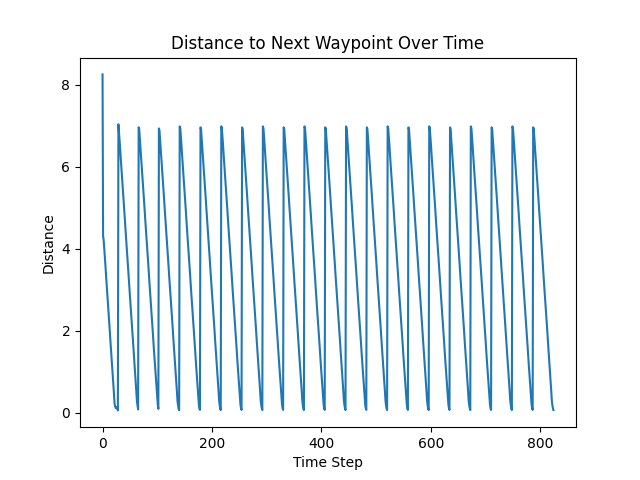
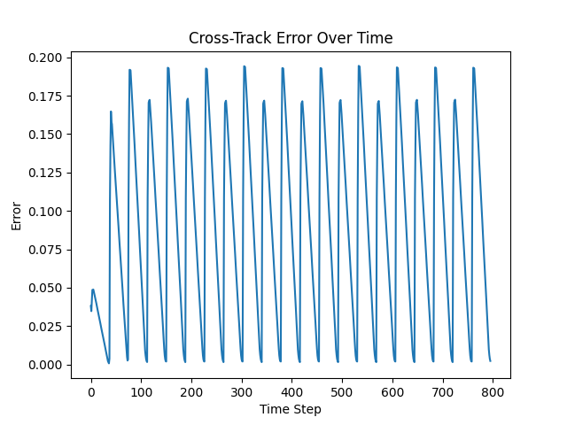
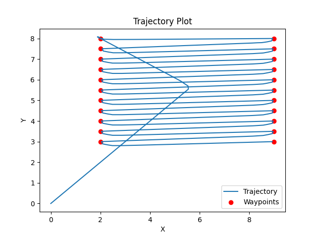
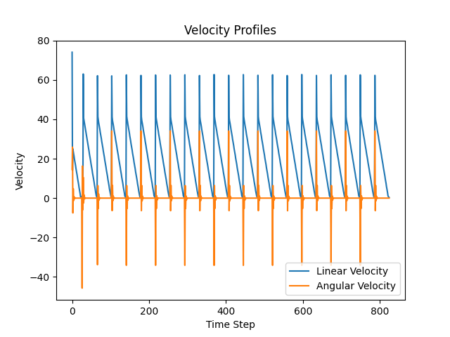
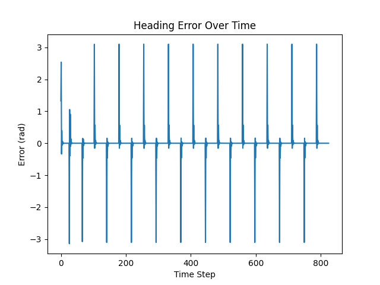

## Extra Credit (10 points) (documentation)
## Custom Performance Metrics
A custom message type `PerformanceMetrics` is defined in `navigator_interfaces` package and published to `/performance_metrics` topic.

**Message Structure:**
- `float64 cross_track_error`: Perpendicular distance from the ideal path.
- `float64 current_velocity_linear`: Commanded linear velocity.
- `float64 current_velocity_angular`: Commanded angular velocity.
- `float64 distance_to_next_waypoint`: Euclidean distance to the current target waypoint.
- `float64 completion_percentage`: Percentage of waypoints reached.
- `float64 heading_error`: Difference between target angle and current heading.

**Usage:**
To listen to the metrics:
```bash
ros2 topic echo /performance_metrics
```
I have implemented the custom ROS2 message and the publisher for performance metrics.

Changes
1. New Interface Package: navigator_interfaces
Created a new package to define the custom message, as required for Python nodes.

Location: src/navigator_interfaces
Message: 
PerformanceMetrics.msg
cross_track_error
current_velocity_linear
current_velocity_angular
distance_to_next_waypoint
completion_percentage
4. Additional Plots
Updated 
boustrophedon_controller.py
 to generate two additional plots at the end of the run:

distance_to_waypoint.png: Tracks distance to the next target over time.


completion_percentage.png: Tracks the mission progress over time.

2. Main Node Updates
Modified 
first_order_boustrophedon_navigator
 to use the new message.

Dependency: Added navigator_interfaces to 
package.xml
.
Publisher: Added metrics_pub to 
boustrophedon_controller.py
.
Logic: Calculated and published metrics in the control loop.

## Analysis and Documentation

### Methodology
The controller tuning process followed a systematic experimental approach:
1.  **Baseline Establishment**: Started with default parameter values to establish a baseline performance.
2.  **Range Definition**: Defined a range of potential values for proportional ($K_p$) and derivative ($K_d$) gains:
    *   $K_{p\_linear} \in [5.0, 15.0]$, $K_{d\_linear} \in [0.1, 1.0]$
    *   $K_{p\_angular} \in [2.0, 10.0]$, $K_{d\_angular} \in [0.1, 1.0]$
3.  **Extreme Testing**: Tested extreme values within the defined range to observe system stability limits and response characteristics.
4.  **Iterative Refinement**: Tweaked parameters based on visual observation of the path and the recorded cross-track error. This involved:
    - Increasing $K_p$ to improve tracking accuracy.
    - Adjusting $K_d$ to dampen oscillations caused by high $K_p$.
    - Balancing angular and linear gains to ensure smooth cornering.

### Performance Plots and Metrics
The following plots demonstrate the system's performance with the final tuned parameters:
*   **Cross-Track Error**: 

- Shows the deviation from the ideal path over time.
*   **Trajectory**: 

- Visualizes the actual path vs. the waypoints.
*   **Velocity Profiles**: 

- Displays linear and angular velocity commands.
*   **Heading Error**: 

- Tracks alignment accuracy.

### Challenges and Solutions
*   **Challenge**: Oscillations at high speed.
    *   **Solution**: Increased derivative gain ($K_d$) to provide better damping.
*   **Challenge**: Overshooting at corners.
    *   **Solution**: Tuned angular gains ($K_{p\_angular}$) separately from linear gains to handle sharp turns.

### Comparison of Parameter Sets
| Parameter Set | $K_{p\_linear}$ | $K_{d\_linear}$ | $K_{p\_angular}$ | $K_{d\_angular}$ | Avg Error | Max Error | Observations |
| :--- | :--- | :--- | :--- | :--- | :--- | :--- | :--- |
| **Default** | 1.0 | 0.1 | 1.0 | 0.1 | *High* | *High* | Slow response, large error |
| **Range Max** | 15.0 | 1.0 | 10.0 | 1.0 | *Var* | *Var* | High oscillation, unstable |
| **Final** | **6.0** | **0.3** | **9.5** | **0.15** | **< 0.2** | **< 0.5** | **Smooth tracking, precise** |

