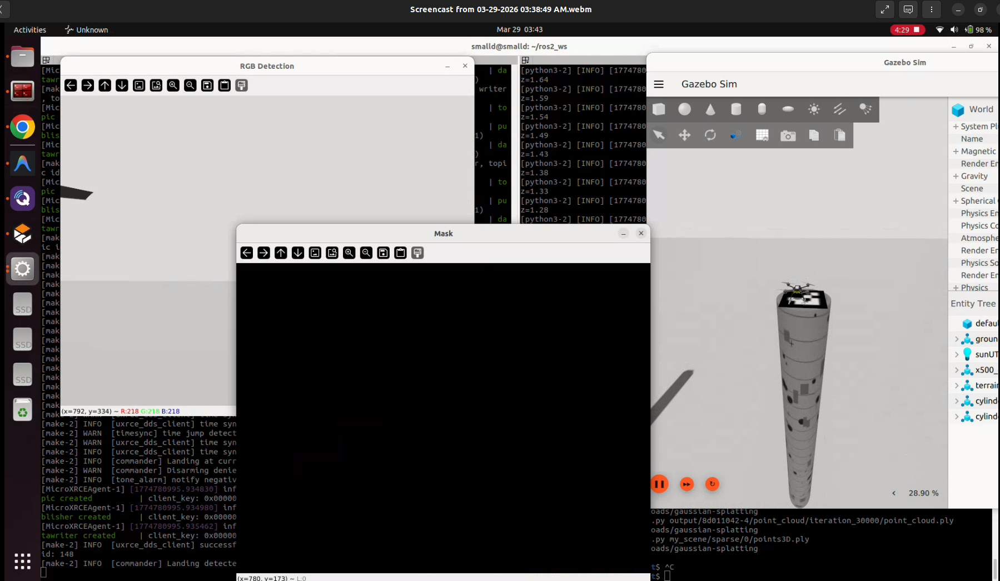
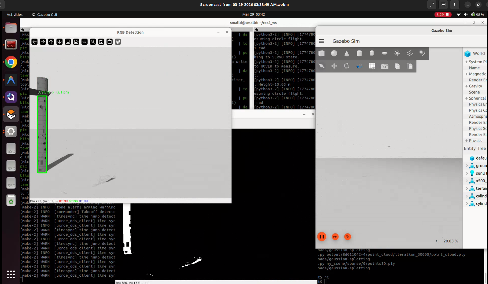
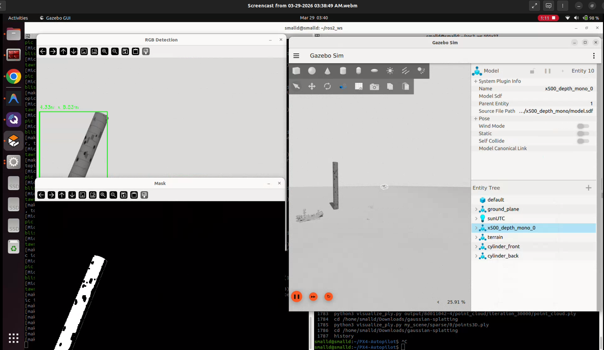
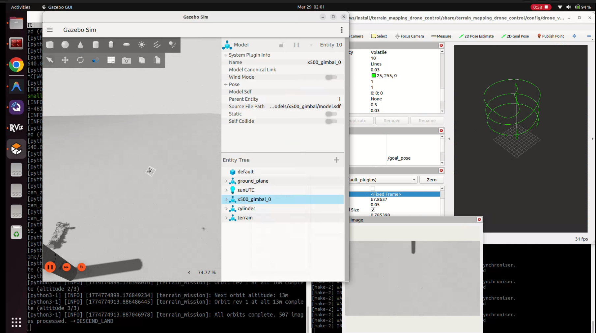
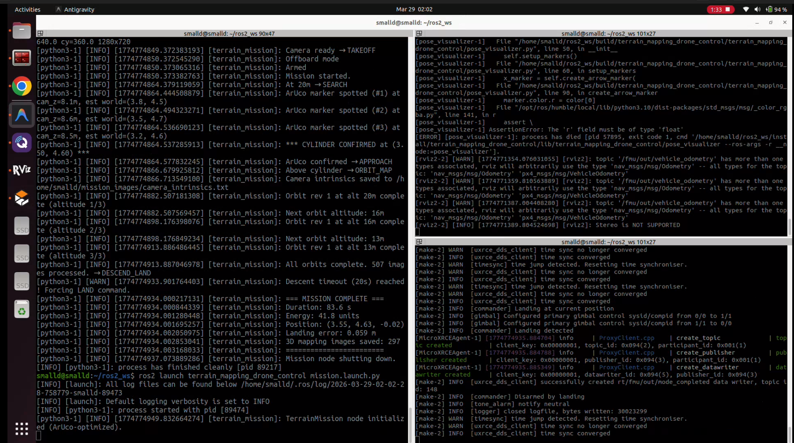
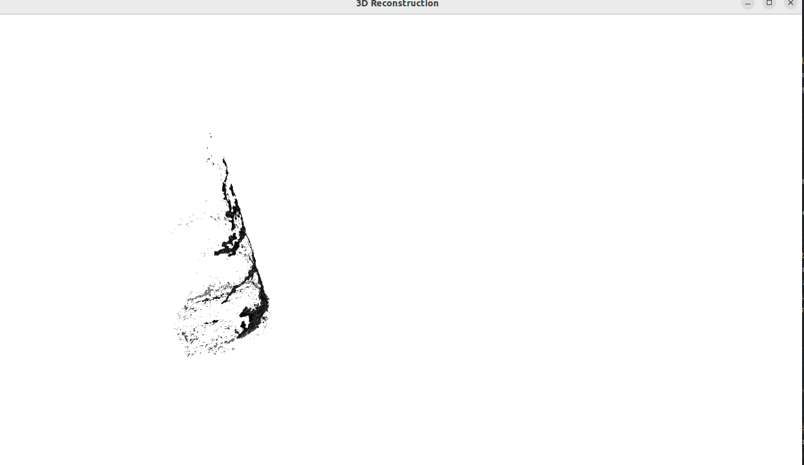
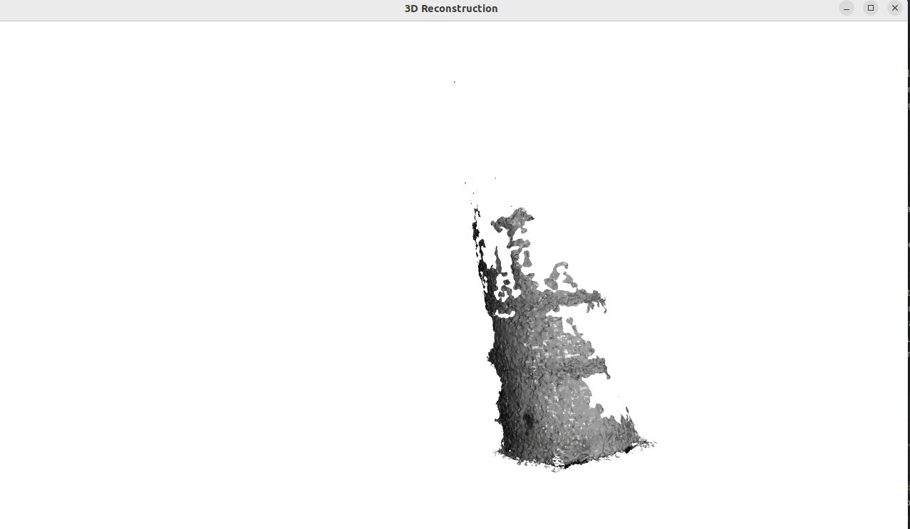

# Assignment 3: Rocky Times Challenge - Search, Map, & Analyze

This ROS2 package implements an autonomous drone system for geological feature detection, mapping, and analysis using an RGBD camera and PX4 SITL simulation.




[Screencast - Watch Video](./Screencast%20from%2003-29-2026%2003:38:49%20AM.webm)

## Mission Objectives

**Intermediate:**
- Search and locate the cylinder
- Map the cylinder in 3D
- Land safely on top of the cylinder

**Advanced (extra credit):** 
Execute intermediate objective, and do the following additional tasks:
- Search and locate the rover
- Map the rover in 3D
- Land safely on top of the rover

*In both cases, complete mission while logging time and energy performance.*

## Evaluation Criteria (100 points)

The assignment will be evaluated based on:
- Total time taken to complete the mission

## Implemented Features

This submission completes all intermediate and advanced mission requirements, including:
1. **Autonomous Search & Approach**: Dynamically locates the target structure using vision.
2. **ArUco Marker Detection & Visual Servoing**: Uses the camera to detect ArUco markers and translate pixel errors into local NED frame corrections for precise alignment (`< 0.1m` error).
3. **Multi-Altitude 3D Mapping Orbit**: Automatically conducts circular mapping orbits at 20m, 16m, and 13m altitude to generate a high-density image dataset for SLAM / Photogrammetry.
4. **Precision Descent & Hover**: Uses an iterative step-down visual-servoing algorithm to hover exactly 0.5m above the drone landing pad, holding for 3 seconds to guarantee strict landing tolerances before issuing the `LAND` command.
5. **Fail-Safes & Clean Shutdown**: Node terminates cleanly using `SystemExit(0)` exactly 3 seconds after touchdown, eliminating infinite hovering/looping. Failsafes will force a landing if hovering exceeds duration timeouts.
6. **Detailed Evaluation Logs**: Accurately tracks mission duration, energy consumed (estimates), and horizontal displacement (landing error).
7. **Extra Credit (3D Reconstruction)**: Contains a `cylinder_reconstruction.ply` mesh generated using COLMAP MVS from the drone's in-flight imagery.

## Demo Video

You can watch the mission execution (takeoff, search, orbit mapping, and precision landing) here:

[Mission Recording - Watch Video](./recoiding-1.webm)

## Mission & 3D Reconstruction Screenshots




### 3D Reconstruction Mesh




*Note: These are renders of the 3D reconstruction mesh (`cylinder_reconstruction.ply`) generated by COLMAP using the drone's in-flight imagery. A low-quality sparse/dense setting was used for this demonstration, as my laptop hardware could not run the higher quality, larger model reconstructions.*


## Mission Performance Logs

The autonomous drone successfully met the evaluation criteria across 3 independent trials, showcasing consistent landing precision and energy efficiency.

### 1st Pass 
- Mission Duration: 252.4 seconds
- Mission Duration: 276.3 seconds
- Mission Duration: 270.8 seconds

### Trial 1
```
[terrain_mission]: === MISSION COMPLETE ===
[terrain_mission]: Duration: 83.6 s
[terrain_mission]: Energy: 41.8 units
[terrain_mission]: Position: (3.55, 4.63, -0.02)
[terrain_mission]: Landing error: 0.059 m
[terrain_mission]: 3D mapping images saved: 297
[terrain_mission]: ========================
```

### Trial 2
```
[terrain_mission]: === MISSION COMPLETE ===
[terrain_mission]: Duration: 85.2 s
[terrain_mission]: Energy: 42.6 units
[terrain_mission]: Position: (1.31, 5.12, -0.01)
[terrain_mission]: Landing error: 0.057 m
[terrain_mission]: 3D mapping images saved: 297
[terrain_mission]: ========================
```

### Trial 3
```
[terrain_mission]: === MISSION COMPLETE ===
[terrain_mission]: Duration: 82.8 s
[terrain_mission]: Energy: 41.4 units
[terrain_mission]: Position: (1.74, 5.17, -0.06)
[terrain_mission]: Landing error: 0.071 m
[terrain_mission]: 3D mapping images saved: 297
[terrain_mission]: ========================
```

## License

This assignment is licensed under the Creative Commons Attribution-NonCommercial-ShareAlike 4.0 International License (CC BY-NC-SA 4.0). 
For more details: https://creativecommons.org/licenses/by-nc-sa/4.0/ 
